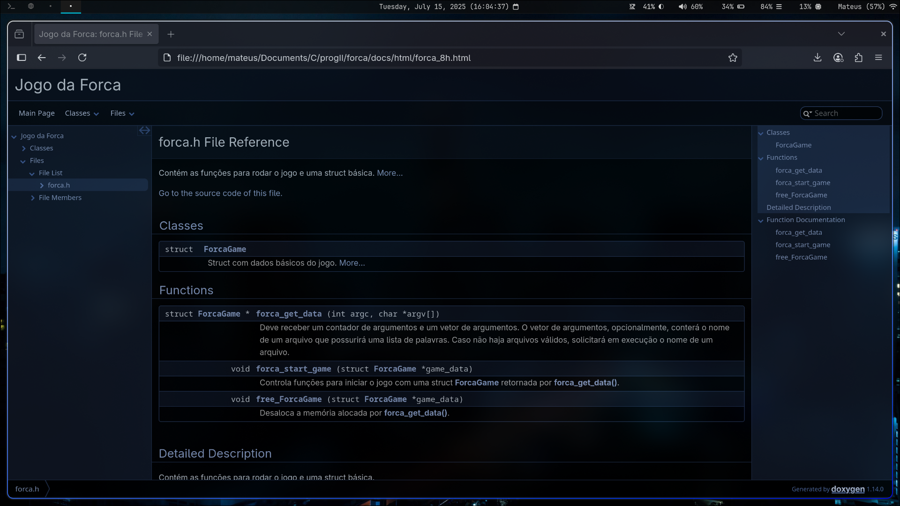

# Forca
# O básico de programação
O estudo do báciso em programação II nos dá o entendimento fundamental de como
ler código fonte, dado uma função, ela recebe parâmetros, faz alguma coisa que
deve ser descrita de uma forma superficial em algumas linhas, e possui um
retorno. Portanto, há 3 fundamentos em uma função:

1. Quais parâmetros a função recebe.
2. O que ela faz.
3. O que ela retorna.

## Main
A main, ainda é uma função, que normalmente recebe como argumento um
inteiro(argument counter), e um array de ponteiros(argument vector).
Esses argumentos devem ser passados na inicialização do programa.
```bash
./forca arg1 arg2
```
```c
int main(int argc, char *argv[]) {
  printf("%s\n", argv[1]); // irá imprimir na tela arg1
  printf("%s\n", argv[2]); // irá imprimir na tela arg2
}
/* nota: se caso não for passado argumentos e o programa tentar imprimir,
// temos um acesso de mémoria inválido, causando um crash */
```

## Arquivos
Uma das frases icônicas do mundo unix é 'everything is a file', sua câmera
pode ser lida como um arquivo, seu microfone ou seu teclado, madando bits
e recebendo bits.

No C, temos stdin, que é a entrada padrão, normalmente é o seu teclado. stdout
que é a saída padrão, normalmente seu terminal. stderr, que é a saída de erro
padrão, normalmente seu terminal, o uso correto dessas saídas em um programa
é fundamental para debug.

Podemos usar funções de arquivos para imprimir erros ou conteúdo, e ler
da entrada padrão
```c
fprintf(stdin, "Olá mundo!"); // adiciona a string no buffer do teclado
fprintf(stdout, "Adeus mundo!"); // imprimi no standard output (terminal)
fprintf(stderr, "Errado mundo!"); // imprimi no standard error (terminal)
```
stdout e stderr parecem ser redundantes, mas não são, e para perceber a
diferença o estudo de [shells](https://en.wikipedia.org/wiki/Bash_(Unix_shell))
é essencial.

## Bibliotecas
Bibliotecas em C é um assunto que possui aos montes na web, o uso de palavrinhas
como #ifndef, static, include... não deve ser levado como palavras mágicas. O
entedimento de bibliotecas em C leva a compreensão de outras 'palavras mágicas'
como public, private do java, pub do rust e outras linguagens.

# Download
```bash
git clone https://github.com/mateus0san/forca.git
```

# Compilando
Compilaçãcao dependente de IDE não será documentada, seria extremamente
casativo demostrar todos os casos (CodeBlocks, Vscode, Visual Studio...)

Todos os comandos a seguir devem ser rodados dentro do diretório do projeto.
## Compilando com cmake
Caso possua o cmake instalado e configurado, no diretório do projeto rode:
```bash
mkdir build
cd build
cmake ..
cmake --build .
```

## Compilando  com GCC
Caso seu shell aceite 'wildcard expansion'
```bash
gcc *.c
```
Caso seu shell não aceite 'wildcard expansion'
```bash
gcc forca_data.c forca_draw.c forca_game.c system_compatible.c main.c
```

# Executando
A lista de palavras aceita no programa segue esse padrão
```text
javascript
python
rust
java virtual machine
```
## Executando: Método 1
O programa aceita um arquivo como argumento, esse arquivo deve ser uma lista de
palavras
```bash
./forca arq
```

## Executando: Método 2
Caso não seja informado nenhum argumento na inicialização do programa, o
usuário deverá informar o nome do arquivo em execução.
```bash
Enter the file name: arq
```

# source code tree
```text
forca/
├── src/
│   ├── main.c
│   ├── forca_data.c     responsável por lidar com arquivos
│   ├── forca_game.c     responsável por lidar com a lógica do jogo
│   ├── forca_draw.h     responsável por desenhar no output 
│   ├── system_compatible.c   define funções compátivies com o sistema
│ bibliotecas, (possuem a declaração de funções e structs públicas)
│   ├── forca.h
│   ├── forca_draw.h
│   └── system_compatible.h
```

# Descrição das funções públicas e structs públicas 

## Structs
```c
struct ForcaGame {
  char **word_list; // lista de palavras
  char *tip;        // nome do arquivo
  int n_words;      // quantidade de palavras 
};
```

## Função forca_get_data
```c
struct ForcaGame *forca_get_data(int, char **);
```
### Descrição
Deve receber um contador de argumentos e um vetor de argumentos. O vetor de
argumentos, opcionalmente, conterá o nome de um arquivo que possurirá
uma lista de palavras. Caso não haja arquivos válidos, solicitará em execução
o nome de um arquivo.
### Retorno
Retornará um ponteiro para um struct ForcaGame que foi alocada dinamicamente.
O usuário precisará desalocar usando a função free_ForcaGame.

## Função free_ForcaGame
```c
void free_ForcaGame(struct ForcaGame *); 
```
### Descrição
Desaloca a memória para a struct ForcaGame que foi retornada com forca_get_data.

## Função forca_start_game
```c
void forca_start_game(struct ForcaGame *);
```
### Descrição
Inicializa o jogo com a struct que foi retornada por forca_get_data

# Documentação estilo API com Doxygen

